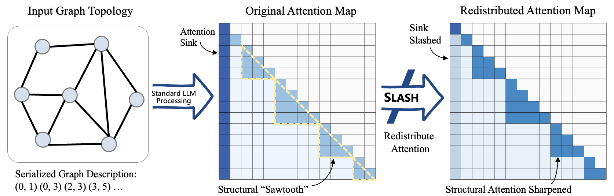

# SLASH the Sink: Sharpening Structural Attention Inside LLMs

<p align="center">
  <a href="https://proceedings.mlr.press/"></a>
  <a href="https://github.com/liuyiming01/SLASH"></a>
  <a href="LICENSE"></a>
</p>

<p align="center">
  
</p>

Official PyTorch implementation of **"SLASH the Sink: Sharpening Structural Attention Inside LLMs"**, accepted at **ICML 2026**.

---

## Overview

LLMs spontaneously reconstruct graph topology internally — evidenced by a distinct "sawtooth" pattern in attention maps — but this latent structural signal is suppressed by the **attention sink**. We formalize this as a **representation bottleneck** arising from the *anisotropy-isotropy conflict*: the model's pre-trained anisotropic bias obstructs the isotropic information flow required for graph reasoning.

**SLASH** (Str**u**ctura**L** **A**ttention **SH**arpening) resolves this bottleneck via a training-free, plug-and-play attention redistribution at inference time — no fine-tuning, no architectural changes.

---

## Repository Structure

```
SLASH/
├── src/slash/              # Core SLASH modules
│   ├── entropy.py          # Entropy-based activity filtering (offline phase)
│   ├── scoring.py          # Structural concentration scoring (offline phase)
│   ├── final_select.py     # Head/layer selection
│   ├── datasets.py         # Dataset loading utilities
│   └── utils.py            # Shared utilities
├── modeling/               # Modified attention implementations
│   ├── SlashAttnModifier.py            # Core attention sharpening module
│   ├── modeling_llama_attn_shift.py    # Llama-3 integration
│   ├── modeling_mistral_attn_shift.py  # Mistral integration
│   └── modeling_qwen3_attn_shift.py    # Qwen3 integration
├── scripts/
│   ├── graphwiz/run_select.sh          # Offline head selection (GraphInstruct)
│   └── molecularNet/run_select.sh      # Offline head selection (MolecularNet)
├── baselines/
│   ├── GraphWiz/           # Evaluation scripts for GraphInstruct
│   └── molecularNet/       # Evaluation scripts for MolecularNet
└── requirements.txt
```

---

## Installation

```bash
git clone https://github.com/liuyiming01/SLASH.git
cd SLASH
pip install -r requirements.txt
```

Experiments were conducted with PyTorch 2.3.1 and Hugging Face Transformers v4.41.3 on NVIDIA RTX 4090 GPUs.

---

## Data & Model Preparation

**Datasets:**
- **GraphInstruct:** Download from the [GraphWiz](https://github.com/nuochenpku/Graph-Reasoning-LLM) repository and place under `GraphWiz/GraphInstruct-Test/`.
- **MolecularNet:** Download via [ChemLLMBench](https://github.com/ChemFoundationModels/ChemLLMBench) and place under `ChemLLMBench/data/property_prediction/`.

**Models:** All models are loaded from Hugging Face Hub automatically. The scripts use:
- General-purpose: `meta-llama/Llama-3.2-3B-Instruct`, `meta-llama/Meta-Llama-3.1-8B-Instruct`, `Qwen/Qwen3-4B`, `Qwen/Qwen3-8B`, `Qwen/Qwen3-14B`
- Fine-tuned baselines: `GraphWiz/Mistral-7B-RFT`, `GraphWiz/LLaMA2-7B-DPO`, `GraphWiz/LLaMA2-13B-DPO`, `YuyanLiu/MolecularGPT`

---

## Usage

SLASH operates in two phases: an **offline** phase that identifies topology-aware attention heads and calibrates the sharpening factor γ, and an **online** phase that applies the sharpening at inference time. The following uses GraphInstruct as an example; MolecularNet follows the same structure under `scripts/molecularNet/` and `baselines/molecularNet/`.

### Step 1 — Offline: Head Identification

Run entropy filtering and structural scoring to identify topology-aware layers:

```bash
bash scripts/graphwiz/run_select.sh
```

This outputs per-model layer selection configs (JSON) under `outputs/final_select/`.

### Step 2 — Offline: γ Calibration

Sweep γ ∈ {0.1, …, 0.9} on a small held-out calibration set:

```bash
bash baselines/GraphWiz/cal.sh
```

### Step 3 — Online: Evaluation

Run evaluation with the identified heads and calibrated γ:

```bash
bash baselines/GraphWiz/eval.sh
```

### Applying SLASH to Your Own Model

The core modifier can be used standalone:

```python
from modeling.SlashAttnModifier import SlashAttnModifier

modifier = SlashAttnModifier(
    layers_heads_to_modify={"10": [2, 5], "12": [1, 3]},  # from offline selection
    gamma=0.6,      # calibrated per model-task pair
)
# Pass modifier into the patched modeling_*_attn_shift.py forward hooks
```
---

## Citation

If you find this work useful, please cite:

```bibtex
@inproceedings{liu2026slash,
  title     = {SLASH the Sink: Sharpening Structural Attention Inside LLMs},
  author    = {Liu, Yiming and Lu, Bin and Wang, Xinbing and Zhou, Chenghu and Jin, Meng},
  booktitle = {Proceedings of the 43rd International Conference on Machine Learning},
  series    = {Proceedings of Machine Learning Research},
  year      = {2026},
  publisher = {PMLR}
}
```
